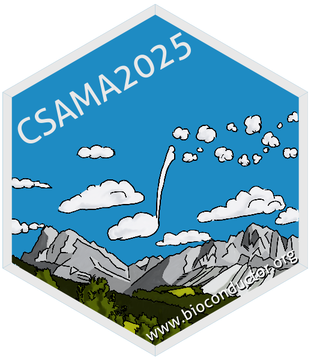
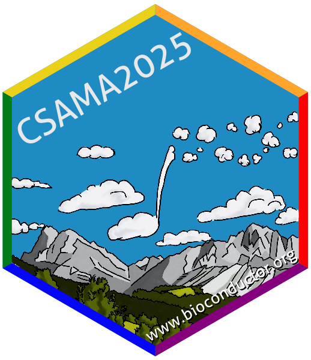
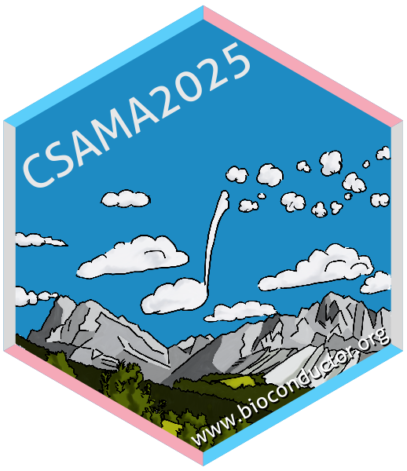

# The sticker for the CSAMA 2025 workshop

* Workshop webpage: [CSAMA 2025](https://csama2025.bioconductor.eu/).
* Where: Brixen/Bressanone, Italy.
* When: July 2025.
* The sticker shows mountains close to Brixen
  ([Peitlerkofel](https://en.wikipedia.org/wiki/Peitlerkofel) and the [Aferer
  Geisler](https://de.wikipedia.org/wiki/Aferer_Geisler)); the logo of
  Bioconductor is hinted in the sky (as a cloud).
* Sticker designer: Johannes Rainer (@jorainer).
* License for the sticker and all drawings and pictures in this folder: Creative
  Commons Attribution
  [CC-BY](https://creativecommons.org/licenses/by/2.0/). Feel free to share and
  adapt, but don't forget to credit the author.

