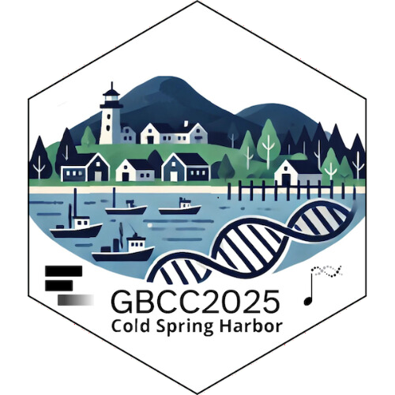

# Galaxy Bioconductor Community Conference 2025 Sticker

* This is the sticker for the Galaxy Bioconductor Community Conference 2025
  [**GBCC2025**](https://gbcc2025.bioconductor.org/).
* Sticker designer: Marie Jossé
* The sticker features a quaint coastal village with a lighthouse, several
  small houses and trees, and a backdrop of mountains. In the foreground, there
  is a body of water with several boats and a pier. A DNA double helix goes
  across the foreground of sticker.
* License for the sticker and all drawings and pictures in this folder: Creative
  Commons Attribution
  [CC-BY](https://creativecommons.org/licenses/by/2.0/). Feel free to share and
  adapt, but don't forget to credit the author.

