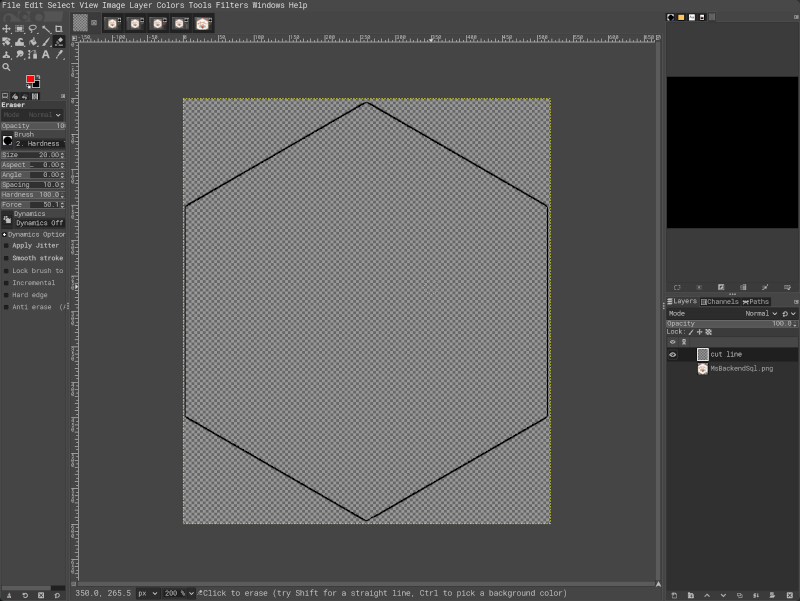

# Improve and fix proper cutting of the stickers

Some sticker printing services have issues correctly identifying the border of
the hex-stickers and hence correctly cut the sticker in die-cut format. This
guide describes an approach that can help the printing facilities to correctly
cut the stickers. In addition to the *main* sticker file (in png file format) an
additional version is created with a second layer that defines the border of the
hex-shaped sticker and hence the exact line where the printed sticker should be
cut. This additional file, usually in a file that supports several layers, such
as the Adobe Photoshop format (.psd), can be provided (separately to the
original order) to the printing service.

This guide explains the approach step by step using one example sticker (for the
[MsBackendSql](https://bioconductor.org/packages/MsBackendSql) package).

The png image file of the sticker was created using the
[MsBackendSql.R](../../MsBackendSql/MsBackendSql.R) R script.

We first open this png file using the [GIMP GNU Image Manipulation
Program](https://www.gimp.org/), choose the *Fuzzy Select Tool* (encircled in
red in the image below) and select the *background*, i.e., click on the
transparent background (*checkerboard*) e.g. on the top left part of the image.

As a result, the border of the hex-sticker as well as the image border should
have been selected. We next open the *Select* menu (either in the menu or using
a click with the right mouse button) and choose the option *To Path*. This has
now created a path for the selection and we should see it if we change to the
*Paths* tab (next to *Layers*; encircled in red in the image below).

We next create a new layer using the menu *Layer*, *New Layer*. Ensure that the
layer is not filled with a color, but is transparent. As name for the layer we
use ideally something meaningful like "cut line". Also make sure that this new
layer is selected/active by changing the *Layers* tab and selecting the just
created layer (this should happen by default when a new layer is created).

Next we draw the border into this new layer. To do so, we change again to the
*Paths* tab (see above), right click on the path *Selection* (which should open
a menu like shown below) and select *Stroke Path*. For the settings of the line
it is suggested to select in the *Choose Stroke Style* pop-up window *Stroke
line*, *solid color* (eventually also checking *antialiasing*) and use a *line
width* of 2 or 3 pixels. After clicking on *Stroke* the line should have been
created (see below). Note that we chose a larger width of the cut line here -
just for easier visualization of the line. As a result there should now be the
border line(s) drawn in the foreground color like shown below.

Unfortunately, with this approach (i.e. selecting the background and
drawing/stroking the border of the selection) we get in addition to the wanted
line representing the outside of the hex-sticker, also a line around the whole
image (shown with a red arrow above). We need next to get rid of this line
which is a tedious manual step. Using the *Eraser tool* we need to ensure to
remove all the black line at the border of the image (zoom into the image to
have better control of the erasing process), without removing/affecting the
black line around the hex-sticker.

As a result, the *cut border* layer of our image should now contain only a
single line defining the border of the sticker (as shown below, i.e. no line
around the edges of the full image).

What remains is that we need to export the sticker. Our sticker has however some
area around the actual hexagon - which we want to remove. We do this by opening
the *Image* menu and clicking on *Crop to Content*. We can next export the image
through the *File* menu and selecting *Export as*. We need to change the file
ending from the default *.png* to *.psd* to ensure the file is exported as a psd
file (which supports multiple layers). Next it is suggested to also (again)
export the sticker itself (without the border). We first change the visibility
of the *cut line* Layer (see below) and then export the image again as a png
file (*File*, *Export as* and choosing a file name with a *.png* as file
ending).

The *png* file can then uploaded/used in sticker printing services such as
[prettygoodstickers](https://www.prettygoodstickers.com/), selecting die-cut
stickers with a height of 5cm and reducing the border as much as possible
(moving the slider to the far left). As a comment for the order eventually
mention that a separate email will be sent with the PSD file that defines the
actual lines for the cutting in a second layer. Then, send an email to *info at
prettygoodstickers.com* referring to the order with the PSD file and explaining
that this contains a layer defining the ideal cut line for the sticker.

These instructions might also work and help with other sticker printing
providers. Also, this guide is far from perfect. So, if you found typos would
like to suggest better descriptions or know an alternative, easier, approach -
PR are always welcome.

# Authors

- Johannes Rainer [jorainer](https://github.com/jorainer)
